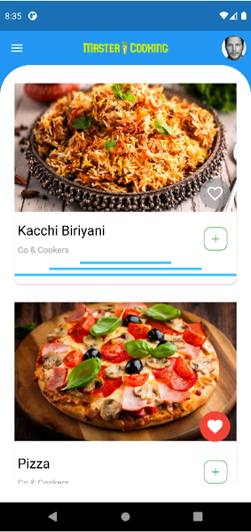
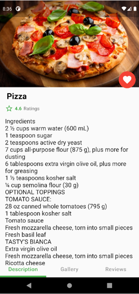
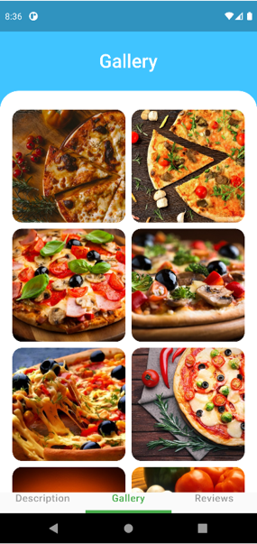
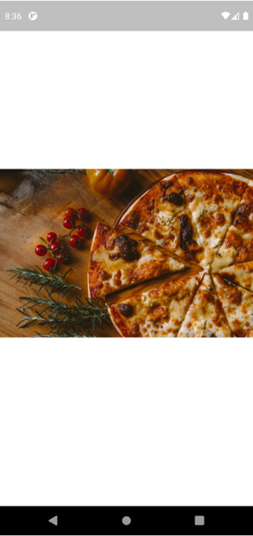
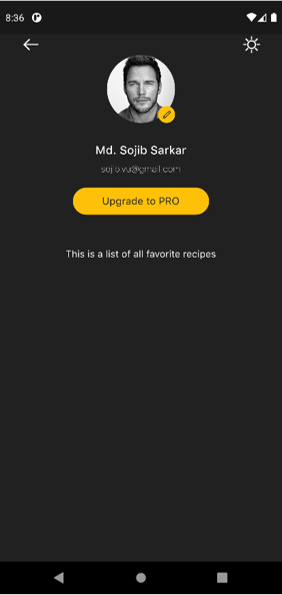
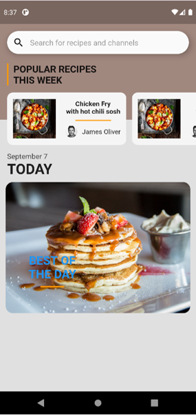
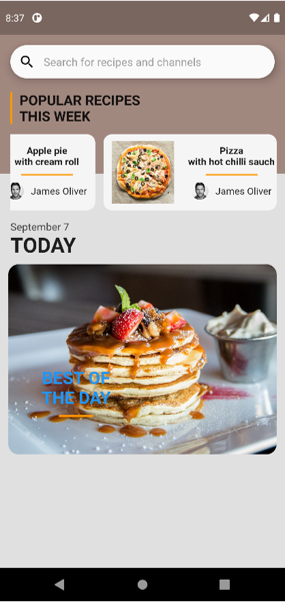

# Master Cooking

A creative and unique Flutter Recipe project. 
 
The goal of this project is to build a cool UI-based recipe application where users can contribute their cooking skills and can earn from them. 
In This project, Some recipes are attached build-in in order to create a cooking environment among the users. 
There are 30+ recipes and each one of them has 8 to 10 different images with the procedure to cook the recipe. 
User can create their own account and can fetch new recipes from the **Firebase Database** Server. 
This project comes with a creative and amazing UI.
## The key features of the project: 
1. Information about daily cooking recipes
2. Over 30+ delicious recipes with instructions.
3. Rating and Comments on Each Recipe.
4. Online Recipe Providing System.
5. User Profile System.
6. Dark and White Mode in User Profile.

### Now, Let us see the project:
Home Page:  
 
Recipe Details Page:  
 
Recipe Gallery Page:  
 
Recipe Image (in zoom):  
 
Recipe Review (build-in):  
 
User Profile (Dark Mode):  
 
User Profile (Bright Mode):  
 
Online Recipe Page:  
 
Online Recipe Page (cont.):  
 
  
[N:B: This project is under development. That is why some of the features are about to update soon.]
  

